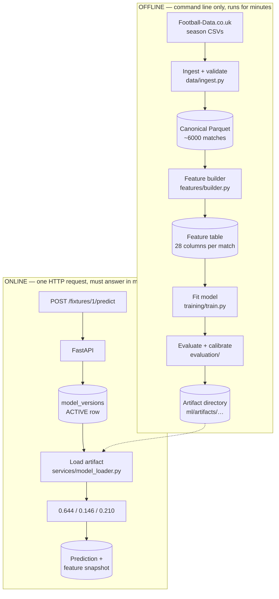

# How it works, and how to learn ML from it

Three questions, answered in order:

1. [How does this project actually work?](#part-1--how-the-project-works)
2. [Where does Hugging Face fit, and what do transformers have to do with football?](#part-2--hugging-face-and-transformers)
3. [How do I use this repository to learn ML and AI, step by step?](#part-3--a-learning-path-through-this-repository)

For setup and commands, see [local-development.md](local-development.md). This
document is about *why* the code looks the way it does.

---

## Part 1 — How the project works

### The one-sentence version

Given two football clubs and a kickoff date, produce three numbers that sum to
one: the probability of a home win, a draw, and an away win.

That framing is the most important decision in the project, and it is worth
pausing on. The system is not asked "who will win?" — that would be
*classification*, and it would be judged on accuracy. It is asked "how likely
is each outcome?", which is *probability estimation*, judged on how well
calibrated those probabilities are. A model that says "55% home win" and is
right 55% of the time is doing its job perfectly, even though it is "wrong"
45% of the time.

### Two halves that never mix



The separation is deliberate and strict. Training touches the whole history of
the league and takes as long as it takes. Serving loads a finished artifact and
answers one fixture. Nothing in the API trains, fits, or computes a statistic
from scratch — because anything computed at request time could differ from what
was computed at training time, and the model would then be reading a feature
that means something slightly different from what it learned.

### The five stages of the offline half

**1. Ingestion** ([`data/ingest.py`](../ml/src/epl_predictor/data/ingest.py),
[`data/validation.py`](../ml/src/epl_predictor/data/validation.py)). Download
one CSV per season, store the raw bytes with a SHA-256 checksum, then validate.
This stage exists because real data is messy in ways that are boring but fatal:
date formats change between seasons (`14/08/10` vs `14/08/2010`), columns appear
and disappear, and the same club is written five different ways. Rows that
cannot be trusted are rejected and *named* in a JSON report, rather than being
silently coerced into something plausible.

**2. Club-name normalisation**
([`data/teams.py`](../ml/src/epl_predictor/data/teams.py)). "Man City",
"Manchester City", and "Manchester City FC" are one club. An alias table maps
every observed spelling to one canonical name. Get this wrong and a club's
history splits in two, so the model sees two mediocre teams instead of one good
one.

**3. Feature engineering**
([`features/`](../ml/src/epl_predictor/features/)). Turn a list of finished
matches into a table where each row describes *what was knowable before that
match kicked off*. Twenty-eight columns: two club names, and 26 numbers —
rolling form over the last five matches, home/away splits, Elo ratings, days of
rest, league position, and differences between the two sides.

**4. Fitting and calibration**
([`training/`](../ml/src/epl_predictor/training/),
[`predictors/calibration.py`](../ml/src/epl_predictor/predictors/calibration.py)).
Fit a model on the early seasons, fit a *calibrator* on a later season, and
report results on a season neither has seen.

**5. Evaluation and the gate**
([`evaluation/`](../ml/src/epl_predictor/evaluation/)). Score everything the
same way, and apply seven explicit criteria before anything is allowed to be
served.

### The idea the whole project is organised around: leakage

If you remember one thing from this codebase, remember this.

**Data leakage** is when a feature contains information that would not have
been available at prediction time. It is the single easiest way to build a
model that looks brilliant and is worthless.

A concrete example. Suppose you build a feature "goals scored by the home team
in their last 5 matches" by grouping the whole dataset by team and taking a
rolling mean. If you are not extremely careful, the window for match *N* will
include match *N* itself. Your model now knows how many goals the home team
scored in the match it is being asked to predict. It will achieve stunning
accuracy in testing and fall apart completely in production, because at
prediction time that number does not exist yet.

This project's defence is a strict ordering, enforced in
[`features/builder.py`](../ml/src/epl_predictor/features/builder.py):

```
for each match, in kickoff order:
    1. read a snapshot of both clubs from the current state
    2. write the feature row
    3. THEN fold this match's result into the state
```

Step 3 must come after step 2. That is the entire trick, and it is why the
builder walks matches one at a time in a Python loop instead of using a fast
vectorised `groupby` — the loop makes the ordering visible and therefore
testable.

And it *is* tested.
[`ml/tests/test_leakage.py`](../ml/tests/test_leakage.py) asserts three
properties against the real dataset:

| Property | What it checks | Why it catches leakage |
| --- | --- | --- |
| Result independence | Rewriting a match's score does not change that match's own features | If it did, the score is leaking into its own row |
| Truncation invariance | Deleting all matches after match *N* does not change match *N*'s features | If it did, the future is leaking into the past |
| State propagation | Rewriting match *N*'s score *does* change match *N+5*'s features | Proves the state is actually being updated, so the first two tests are not passing trivially |

That third test matters more than it looks. A completely broken builder that
returned constant zeros would pass the first two tests perfectly. The third one
is what proves the pipeline does anything at all.

### Chronological validation

The same principle applies to how the data is split. You may **never** split
football matches randomly. A random split puts May 2024 matches in the training
set and September 2023 matches in the test set, so the model effectively knows
the future. Every split here is by time:

| Period | Seasons | Purpose |
| --- | --- | --- |
| Model fit | 2010/11 – 2022/23 | Fit the model's parameters |
| Calibration fit | 2023/24 | Fit *only* the calibrator |
| Validation | 2024/25 | Every number quoted during model selection |
| Test | 2025/26 | Untouched. One final measurement, after selection |

Three periods rather than two, because a calibrator is itself a fitted model. If
you fit a calibrator on the validation season and then report results on that
same season, you have overfitted to it, and the reported improvement is partly
fictional. This is not hypothetical — see the isotonic result in
[Part 3, Stage 5](#stage-5--calibration-making-probabilities-mean-something).

### Nulls are kept honest

A club that has played only two matches has no "points in the last five
matches". The feature is `None`, not `0`. This sounds pedantic and is not: `0`
means "played five and lost all five", which is the opposite of "we do not
know". Each model then decides for itself how to handle missing values —
CatBoost handles them natively, logistic regression imputes the training
median, the foundation models impute and scale inside a saved encoder.

### The serving half

Two design points are worth understanding, because both prevent a class of bug
that produces no error message at all.

**A predictor is never separated from its feature builder.**
[`model_loader.py`](../apps/api/app/services/model_loader.py) returns the two
together as one object. A trained model gets the league state saved inside its
own artifact; the stub predictor gets simple fixture metadata under a different
schema id. If these could be mixed, a model would receive a vector with the
right shape and the wrong meaning, and would return confident nonsense forever
without anything raising.

**Missing or broken models fail loudly.** No `ACTIVE` model, a missing artifact,
or a schema mismatch all produce HTTP errors. Probabilities that do not sum to
one are *rejected*, never quietly renormalised — a broken model should be
visible, not smoothed over.

Every stored prediction also keeps the exact feature vector it used, the schema
version, the model version, and `source_cutoff_at` (the kickoff time). Because
the cutoff is recorded, you can go back months later and audit whether any value
in that vector could genuinely have been known beforehand.

---

## Part 2 — Hugging Face and transformers

This is the part most likely to be confusing, because "Hugging Face" and
"transformers" both mean several things, and only some of them apply here.

### What Hugging Face actually does in this project

Hugging Face plays exactly **one** role: it is where pretrained model weights
are downloaded from. Nothing more.

When [`predictors/tabicl.py`](../ml/src/epl_predictor/predictors/tabicl.py)
first runs, this happens:

```
Checkpoint 'tabicl-classifier-v2-20260212.ckpt' not cached.
 Downloading from Hugging Face Hub (jingang/TabICL).
```

That is the whole integration. The Hub is a file host with versioning — think
"npm for model weights". The `huggingface_hub` library downloads and caches the
checkpoint; the model's own library then loads it.

The five candidates and their Hub repositories:

| Candidate | Hub repository | Licence |
| --- | --- | --- |
| TabICL | `jingang/TabICL` | BSD-3-Clause |
| Mitra | `autogluon/mitra-classifier` | Apache-2.0 |
| TabSTAR | `alana89/TabSTAR` | CC-BY-4.0 card / MIT code |
| TabPFNMix | `autogluon/tabpfn-mix-1.0-classifier` | Apache-2.0 |
| TabPFN-3 | `Prior-Labs/tabpfn_3` | Non-commercial |

Because the Hub hosts weights under a licence, the licence is treated as data in
this codebase, not as a footnote. Look at `CANDIDATES` in
[`predictors/foundation.py`](../ml/src/epl_predictor/predictors/foundation.py):
each entry carries a `license_summary` and a `production_use_allowed` flag, and
the selection gate reads that flag as a hard criterion. TabPFN-3's licence
forbids commercial use, so it can be benchmarked as a research reference and can
*never* be promoted, no matter how good its numbers are.

### "Transformer" means two different things — separate them

This distinction directly answers "what is the role of transformers here":

**1. The transformer *architecture*** — central to all five candidates.

**2. The `transformers` *Python library*** — barely used here.

The HF `transformers` library is the famous one, for BERT/GPT-style text models.
In this project it is needed by exactly one candidate, TabSTAR, and only because
TabSTAR embeds column names and category values as *text*. TabICL declares
`transformers` only for its optional fine-tune/pretrain extras; for normal use it
implements its own architecture directly in `torch` plus `einops`.

So: the architecture is everywhere, the library is almost nowhere. If you were
expecting to find `from transformers import AutoModel` at the heart of this
project, it is not there and should not be.

### These are not language models

A tabular foundation model is a transformer, but it has never seen a word of
text (except TabSTAR, which reads column *names*). The difference is what
attention is computed over:

| | Large language model | Tabular foundation model |
| --- | --- | --- |
| Input | A sequence of word-pieces | A table of rows and columns |
| Attention over | Tokens in the sentence | Cells across columns, then rows across the dataset |
| Pretrained on | Text scraped from the internet | Millions of *synthetic* tables from a statistical prior |
| Asked to | Predict the next token | Predict a target column for unlabelled rows |

That "synthetic tables" row is the surprising and clever part. Nobody pretrained
these models on football. They were pretrained on millions of randomly generated
datasets — random causal structures, random noise, random relationships — until
the model learned something general about *how tabular prediction problems tend
to work*. It is meta-learning: not learning a task, but learning how to learn
tasks of that shape.

This is why [AGENTS.md](../AGENTS.md) insists no language model goes near the
prediction runtime, and why the README has a whole section on why the predictor
is not an LLM. An LLM asked "will Arsenal beat Chelsea?" produces fluent text
resembling analysis, with no calibrated probability behind it. These models
produce an actual probability distribution and can be scored on it.

### In-context learning: `fit` that does not train

Here is the mechanical difference that surprises most people, and it explains a
concrete result in this project.

For a normal model, `fit()` runs an optimisation and burns the learned
information into weights; `predict()` is then a cheap forward pass.

For an in-context model like TabICL or TabPFN, `fit()` **stores the training
rows**. No gradient step is taken. Then `predict()` feeds the stored training
rows *and* the new row through the transformer together, and attention works out
the relationship on the fly — the same way an LLM given five worked examples in
a prompt answers a sixth.

The cost profile inverts:

| | CatBoost (gradient boosting) | TabICL (in-context) |
| --- | --- | --- |
| `fit` | Builds trees; the expensive step | Stores rows; nearly free |
| `predict` one row | ~2.4 ms | ~1000 ms |
| Why | Walk a few hundred small trees | Re-attend over 1520 stored rows |

Those numbers are measured in this repository, not illustrative. And they are
the reason TabICL is currently **rejected**. From
[`ml/reports/candidates/candidates-latest.md`](../ml/reports/candidates/candidates-latest.md):

```
| Model        | Log loss | Brier  | Accuracy | Draw recall | ECE    |
| tabicl-epl   | 0.9940   | 0.5947 | 0.526    | 0.000       | 0.0539 |
| catboost-epl | 1.0225   | 0.6132 | 0.495    | 0.011       | 0.0708 |

- tabicl-epl is rejected against catboost-epl: latency 997.4 ms/fixture exceeds 250 ms
- Selection: no candidate clears the gate, so catboost stays active.
```

Read that carefully, because it is the most instructive result in the project.
The pretrained transformer **is genuinely more accurate** — better log loss,
better Brier score, better accuracy, better calibration. And it is still
rejected, because the API answers one fixture per HTTP request, and a full
second of latency for a 0.03 improvement in log loss is a bad trade.

This is what the README means by "novelty is not an acceptance criterion". A
1000× slower model that is 3% better does not automatically win. Note also that
the latency measurement only tells the truth because the harness times a
*single* fixture; amortising a 380-row batch would have reported ~3 ms and hidden
the problem completely.

### The shared adapter machinery

All five candidates sit behind the same `Predictor` interface, with shared
plumbing in
[`predictors/foundation.py`](../ml/src/epl_predictor/predictors/foundation.py).
Three problems it solves once:

**They are optional.** Each pulls in torch and multi-gigabyte weights, so none
is installed by default. `require_library` turns a missing import into a message
naming the exact install command.

**They want plain numbers.** The v1 schema has club-name strings and nullable
integers. A shared encoder ordinal-encodes clubs, imputes and scales the
numerics, and — importantly — is *fitted once and saved inside the artifact*, so
inference never recomputes an imputation median from whatever data happens to be
loaded.

**They keep their training set.** `context_rows` caps in-context rows at the
most *recent* 1520, which is both the cheaper and the more relevant half of the
history.

One more guard worth knowing about, because it caught a live bug. Several of
these libraries return probability columns sorted **alphabetically**:
`AWAY_WIN, DRAW, HOME_WIN`. This project's canonical order is
`HOME_WIN, DRAW, AWAY_WIN`. A permuted column raises no error anywhere — it
just silently serves home wins as away wins. `reorder_columns` makes the
correction explicit, and TabPFNMix genuinely does report alphabetical order, so
without it the model would have been confidently backwards.

---

## Part 3 — A learning path through this repository

A real codebase is a better teacher than a tutorial, because it cannot skip the
parts that are annoying. This path goes from "what problem is this" to "why did
we reject the fancy model", in eight stages.

Each stage says what to read, what to run, and what to actually notice. Do them
in order; each depends on the last.

> **Practical note.** Installing a candidate extra needs `--inexact`:
> `uv sync --inexact --package epl-predictor --extra tabicl`. Without it, `uv`
> removes the API's dependencies. And be aware that any later `uv run` or `make`
> command re-syncs the environment to the lockfile default and will quietly
> *remove* extras you installed — if a candidate stops importing, that is why.

### Stage 0 — Frame the problem

**Read:** the README's "Prediction contract" and "Why the predictor is not an
LLM" sections.

**Concepts:** classification vs probability estimation; why calibration matters;
why an LLM is the wrong tool.

**Notice:** the output contract is three floats summing to 1.0. Not a winner.
Not a scoreline. Almost every later decision follows from that choice.

**Exercise:** write down what you think a good log loss would be for football,
before you look. Three outcomes, so random guessing scores ln(3) ≈ 1.0986. Now
consider that the best model here scores 0.9940. That gap is *small*. Sit with
that: football is mostly noise, and any project promising 90% accuracy is
lying or leaking.

### Stage 1 — Data engineering is most of the work

**Read:** [`data/validation.py`](../ml/src/epl_predictor/data/validation.py),
then [`data/ingest.py`](../ml/src/epl_predictor/data/ingest.py).

**Run:**

```bash
make ingest seasons=2010:2025
cat ml/reports/ingest/latest.json | head -40
```

**Concepts:** schema drift, checksums for reproducibility, idempotent caching,
rejecting rather than coercing bad rows, canonical storage formats (Parquet).

**Notice:** how much code exists purely to handle inconsistency, and that
nothing is silently fixed — every rejected row is named in a report. This ratio
of plumbing to modelling is normal, and tutorials hide it by handing you a clean
CSV.

**Exercise:** compare the header rows of two raw CSVs:

```bash
head -1 ml/data/raw/E0_1011.csv | tr ',' '\n' | wc -l   # 71 columns
head -1 ml/data/raw/E0_2425.csv | tr ',' '\n' | wc -l   # 120 columns
```

The same competition, the same publisher, 49 extra columns. This is what schema
drift looks like in practice, and why the validator works from an explicit list
of required columns rather than trusting positions or counts. Then read
`parse_source_date` and work out why it must try more than one date format.

### Stage 2 — Leakage and chronological validation

This is the most valuable stage in the project. If you only do one, do this one.

**Read:** [`ml/tests/test_leakage.py`](../ml/tests/test_leakage.py) *before*
reading the builder it tests. The tests state the contract more clearly than the
implementation does.

**Run:**

```bash
uv run pytest ml/tests/test_leakage.py -v
```

**Concepts:** target leakage, train/test contamination, chronological (walk-
forward) splits, why `train_test_split(shuffle=True)` is malpractice for time
series.

**Notice:** the three properties in [Part 1](#the-idea-the-whole-project-is-organised-around-leakage),
and specifically why the third one is needed to make the first two meaningful.

**Exercise:** deliberately break it. In
[`features/builder.py`](../ml/src/epl_predictor/features/builder.py), move the
"record the match into state" call *before* the "write the feature row" call.
Run the leakage tests and watch them fail. Then run `make features` and
`make baselines` and see the log loss collapse to something implausibly good.
That number is what a leaking model looks like — memorise the feeling of
seeing it, then `git checkout` the file.

### Stage 3 — Feature engineering

**Read:** [`features/elo.py`](../ml/src/epl_predictor/features/elo.py) first —
it is self-contained and elegant. Then
[`features/state.py`](../ml/src/epl_predictor/features/state.py), then
[`features/builder.py`](../ml/src/epl_predictor/features/builder.py).

**Run:**

```bash
make features
uv run python -c "
from epl_predictor.features.builder import load_features
t = load_features()
print(t.shape)
print(t[['home_team','away_team','home_elo','away_elo','elo_difference','outcome']].tail(10))
"
```

**Concepts:** rating systems as state machines, rolling-window aggregation,
representing "unknown" honestly, difference features, domain knowledge as
feature design.

**Notice:** the printed shape is `(6080, 32)` — 6080 matches, of which **28
columns are the features** and the remaining four are identifiers and the
target (`match_id`, `kickoff_date`, `outcome`, and the raw `result`). Only the
28 are ever shown to a model; `features_frame` selects them by name, in schema
order, so a reordered or renamed column fails loudly instead of shifting
meaning.

**Notice:** Elo is a *stateful* feature — its value for a match depends on the
entire preceding history. That is what makes it powerful and what makes leakage
so easy. Note also `apply_season_regression`, which pulls ratings toward the
mean each summer, encoding the domain fact that squads change.

**Exercise:** Elo has three constants: `K_FACTOR`, `HOME_ADVANTAGE`, and
`SEASON_REGRESSION`. Change `HOME_ADVANTAGE` to 0, rebuild features, rerun
`make baselines`, and see what home advantage is worth in log loss. Then try
doubling it.

### Stage 4 — Baselines and metrics

**Read:** [`evaluation/metrics.py`](../ml/src/epl_predictor/evaluation/metrics.py),
then the three baselines: `dummy.py`, `class_frequency.py`,
`logistic_regression.py`.

**Run:**

```bash
make baselines
open ml/reports/baselines/baselines-latest.md   # or just read it
```

**Concepts:** log loss vs Brier vs accuracy, per-class precision/recall,
confusion matrices, expected calibration error, and above all *baselines as
measuring instruments*.

**Notice:** the ladder of results, and read it as a series of differences rather
than a leaderboard:

| Model | Log loss | The gap to the model above tells you… |
| --- | --- | --- |
| dummy (fixed probabilities) | 1.0866 | — |
| class-frequency | 1.0822 | …almost nothing. The hard-coded guess was already near the base rates. |
| logistic-regression | 1.0359 | **…how much signal the 28 features carry at all.** The biggest single jump. |
| catboost | 1.0141 | …how much of that signal is non-linear. |
| tabicl | 0.9940 | …what a pretrained transformer adds on top. |

This is the real reason baselines are mandatory. Without the class-frequency
row, you could not tell whether logistic regression was learning football or
just learning that home teams win more often. Each baseline isolates one
question.

**Notice also:** draw recall is 0.000 for almost everything. Draws are ~25% of
matches and essentially unpredictable, so a model minimising log loss learns
never to bet on one. That is a genuine limitation of the approach, not a bug —
and it is why draw recall and precision are reported as first-class metrics
instead of being buried in a per-class table where nobody would look.

**Exercise:** compute log loss by hand for a single match. Take one row's
predicted probabilities and its actual outcome, and evaluate `-ln(p_actual)`.
Then do it for a match the model got confidently wrong, and see how brutally
log loss punishes confident errors compared to accuracy, which treats all
mistakes alike.

### Stage 5 — Calibration: making probabilities mean something

**Read:** [`predictors/calibration.py`](../ml/src/epl_predictor/predictors/calibration.py).

**Concepts:** calibration vs discrimination, temperature scaling, isotonic
regression, Platt/sigmoid scaling, reliability, and overfitting a
post-processing step.

**Notice this row** in the baselines report, which is the best cautionary tale
in the repository:

| Model | Log loss |
| --- | --- |
| catboost (identity — no calibration) | **1.0141** |
| catboost (sigmoid) | 1.0203 |
| catboost (temperature) | 1.0225 |
| catboost (isotonic) | **1.3730** |

Isotonic calibration made CatBoost **dramatically worse** — from 1.0141 to
1.3730, far worse than the dummy model. Isotonic regression is flexible enough
to fit its calibration season closely and then generalise terribly to the next
one. This is overfitting, caught in the act, by a post-processing step most
people assume is harmless.

It is also exactly why the calibrator gets its own dedicated season. Had the
calibrator been fitted on the validation season and scored there, isotonic
would have looked like the *winner*.

**Exercise:** in [`training/baselines.py`](../ml/src/epl_predictor/training/baselines.py),
change `CALIBRATION_SEASONS` so the calibrator is fitted on the validation
season instead. Rerun and watch isotonic climb the table. You have just
reproduced, on purpose, one of the most common silent mistakes in applied ML.

### Stage 6 — Gradient boosting, the workhorse

**Read:** [`predictors/catboost.py`](../ml/src/epl_predictor/predictors/catboost.py)
and the shared base [`predictors/tabular.py`](../ml/src/epl_predictor/predictors/tabular.py).

**Run:**

```bash
make train adapter=catboost version=1.0.0
cat ml/artifacts/catboost-epl-1.0.0/model_card.md
```

**Concepts:** decision-tree ensembles, boosting vs bagging, early stopping
against a validation set, native categorical and missing-value handling, and
why gradient-boosted trees remain the default choice for tabular data.

**Notice:** the artifact directory. A model is not just weights — it is weights
*plus* the calibrator, the feature schema version, the class order, the split
ranges, library versions, the git commit, and a model card. All of it is needed
to interpret a probability produced six months from now.

**Exercise:** read `training.json` in the artifact and identify every field you
would need in order to reproduce that exact model. Then ask what is still
missing.

### Stage 7 — Foundation models, transformers, in-context learning

**Read:** [Part 2](#part-2--hugging-face-and-transformers) of this document,
then [`predictors/foundation.py`](../ml/src/epl_predictor/predictors/foundation.py),
then [`predictors/tabicl.py`](../ml/src/epl_predictor/predictors/tabicl.py) —
which is short, because the shared base does the work.

**Run:**

```bash
uv sync --inexact --package epl-predictor --extra tabicl
make candidates only="tabicl"
```

**Concepts:** pretraining and transfer learning, meta-learning on synthetic
priors, in-context learning, attention over tables rather than tokens, the
adapter pattern for keeping an application independent of any one model library.

**Notice:** the first run downloads a checkpoint from the Hugging Face Hub —
that is the entire HF integration, visible in the log. Notice that `fit` takes
about 13 seconds while predicting one fixture takes about a second. Notice that
`TabICLPredictor` contains almost no logic, because the interface was designed
before the candidates were.

**Exercise:** vary `max_context_rows` (try 200, 800, 1520) and plot log loss
against single-fixture latency. You are drawing an accuracy/cost curve, which is
the actual decision a deployment requires — and you may find the knee of that
curve makes TabICL viable after all.

### Stage 8 — Selection, serving, and why "better" is not enough

**Read:** [`evaluation/gate.py`](../ml/src/epl_predictor/evaluation/gate.py),
then [`services/model_loader.py`](../apps/api/app/services/model_loader.py) and
[`services/feature_service.py`](../apps/api/app/services/feature_service.py).

**Run:**

```bash
make db-up && make migrate && make seed
make api          # then, in another terminal:
curl -X POST http://localhost:8000/api/v1/fixtures/1/predict
```

**Concepts:** model selection under multiple constraints, latency and memory
budgets, licence compatibility, artifact round-trip integrity, feature-schema
compatibility, and auditable predictions.

**Notice:** the gate has seven criteria, and an *unmeasured* criterion counts as
a **failure**, not a pass. That single design choice is what stops a model
sliding into production because nobody got round to timing it. Notice too that
TabICL wins on every accuracy metric and is still rejected.

**Exercise:** read `ml/reports/candidates/gate-decisions.json` and, for each of
the seven criteria, write one sentence on how you would defend that threshold to
someone who disagreed. `MAX_INFERENCE_LATENCY_MS = 250` is a judgement call, not
a law — could you justify 500? What would change?

---

## Where to go after this

Concepts this project deliberately does **not** cover, roughly in order of how
naturally they follow:

- **Model registry and promotion.** Partly built here, and listed as a known gap
  in [local-development.md](local-development.md). Implementing it is the most
  useful next exercise in this repo.
- **Hyperparameter search.** Every model here uses fixed, hand-chosen
  parameters. Adding a search means confronting the fact that tuning is itself
  a form of fitting, and needs its own held-out period.
- **Feature importance and explainability.** SHAP values on the CatBoost model
  would tell you which of the 28 features actually matter. There is a good
  chance most of them do not.
- **Poisson / bivariate goal models.** A different framing entirely: model goals
  scored by each side, then derive outcome probabilities. Standard in football
  analytics and a genuinely strong contender against this classification
  framing.
- **Deep learning on tabular data from scratch** — embeddings for clubs,
  sequence models over a season. The README mentions a PyTorch MLP with team
  embeddings as an optional baseline.

Two books worth reading alongside the code: *Designing Machine Learning Systems*
(Chip Huyen) for everything in Stages 1, 5, and 8, and *An Introduction to
Statistical Learning* for the theory under Stages 4 and 6.

Finally, the most transferable lesson in this repository is not the Elo
implementation or the transformer adapters. It is that the accurate model lost.
Being able to measure *why* — and to write that reason down in a report where
somebody can disagree with it — is the skill worth taking away.
