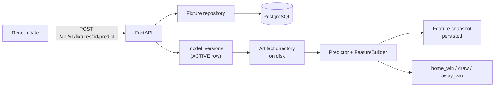

# Local development

How to run the EPL AI Match Predictor on your own machine, and how the pieces
fit together once it is running.

The README describes building this project from scratch. This document assumes
the repository already exists and you want it working in front of you.

## Contents

- [What you need](#what-you-need)
- [First-time setup](#first-time-setup)
- [Running the app](#running-the-app)
- [How it works](#how-it-works)
- [The offline ML pipeline](#the-offline-ml-pipeline)
- [Serving a trained model](#serving-a-trained-model)
- [Foundation-model candidates](#foundation-model-candidates)
- [Everyday commands](#everyday-commands)
- [Troubleshooting](#troubleshooting)

---

## What you need

These versions are the ones this project has actually been run against, on
Apple Silicon macOS:

| Tool | Version used | Notes |
| --- | --- | --- |
| Python | 3.12.14 | 3.12 or newer. The workspace pins `>=3.12`. |
| `uv` | 0.12.9 | Installs and runs everything Python. |
| Node.js | 26.7.0 | For the Vite web app only. |
| Docker | 29.4.0 with Compose | Runs PostgreSQL 17. |

PostgreSQL is the only database this project supports; there is no SQLite
fallback. You do not need PostgreSQL installed on the host, only Docker.

If `uv` is missing:

```bash
curl -LsSf https://astral.sh/uv/install.sh | sh
```

You do **not** need Ollama or a Qwen model to run the application. The README
mentions Qwen as a development assistant only. Per
[AGENTS.md](../AGENTS.md), no language model is part of the prediction runtime.

## First-time setup

Five steps, from a fresh clone to a working app.

**1. Install dependencies.** This creates one virtual environment at `.venv`
for the whole `uv` workspace, covering both `apps/api` and `ml`, and installs
the web app's Node packages.

```bash
make install
```

**2. Create your `.env`.** The committed template has working defaults for
everything except the fixture provider token.

```bash
cp .env.example .env
```

The database URL in the template already matches
[`infra/compose.yaml`](../infra/compose.yaml), so you can leave it alone. The
only value worth changing is `FOOTBALL_DATA_API_TOKEN`, which you need solely
for importing real upcoming fixtures. Get a free key at
[football-data.org/client/register](https://www.football-data.org/client/register).
Everything else, including the entire ML pipeline and the seeded demo
fixtures, works without it.

**3. Start PostgreSQL.** This waits until the container reports healthy, so
the next command cannot race it.

```bash
make db-up
```

**4. Create the schema.** Alembic owns the schema outright — the application
never issues DDL, so this step is required rather than optional.

```bash
make migrate
```

**5. Load demo data.** This inserts six clubs and three upcoming fixtures,
registers the stub predictor in the model registry, and marks it `ACTIVE` so
the app has something to serve.

```bash
make seed
```

Seeding is idempotent: re-running it converges on the same rows. It also
refuses to demote a real model, so once you have promoted a trained model,
`make seed` will leave it active.

## Running the app

Two processes, in two terminals.

```bash
make api    # http://localhost:8000  (reloads on change)
```

```bash
make web    # http://localhost:5173
```

Open <http://localhost:5173>. You should see the three seeded fixtures. Click
**Predict** on one and three percentages appear.

Useful URLs:

| URL | What it is |
| --- | --- |
| <http://localhost:8000/health> | Liveness check |
| <http://localhost:8000/docs> | Interactive OpenAPI documentation |
| <http://localhost:8000/api/v1/fixtures> | Upcoming fixtures as JSON |

To predict from the command line:

```bash
curl -X POST http://localhost:8000/api/v1/fixtures/1/predict
```

```json
{
  "prediction_id": 1,
  "fixture_id": 1,
  "home_team": "Arsenal",
  "away_team": "Chelsea",
  "predicted_outcome": "HOME_WIN",
  "probabilities": { "home_win": 0.644, "draw": 0.146, "away_win": 0.21 },
  "model_name": "catboost-epl",
  "model_version": "1.0.0",
  "feature_schema_version": "1.0.0",
  "created_at": "2026-09-03T20:34:19Z"
}
```

## How it works

### Request path



The important design points:

**Every prediction is traceable.** A prediction row stores the exact feature
vector used, the schema version, the model version, and `source_cutoff_at` —
the kickoff time. Because the cutoff is stored, you can audit later whether
any value in that vector could have been known before kickoff.

**A predictor is never separated from its feature builder.** `model_loader.py`
returns the two together. A trained model gets the league state saved inside
its own artifact; the stub predictor gets fixture metadata under a distinct
schema id (`fixture-meta-1.0.0`). Pairing them at load time removes the
possibility of feeding a model a vector from a different schema, which would
produce confident nonsense with nothing raising an error.

**Missing models fail loudly.** If no model is `ACTIVE`, or its artifact is
missing, or its artifact's feature schema disagrees with its registry row, the
API returns an error. It never falls back to invented probabilities.

| Situation | Status |
| --- | --- |
| Unknown fixture | 404 |
| Fixture already played | 409 |
| Club not in the alias table, so its history is unidentifiable | 422 |
| No `ACTIVE` model, or its artifact will not load | 503 |
| Model returned probabilities that break the output contract | 502 |

That last one matters: probabilities are validated, never repaired. A model
whose output does not sum to one is reported rather than quietly renormalised.

### Leakage safety

The single largest risk in this project is describing a match using
information from that same match. The feature builder enforces one ordering,
and the tests in
[`ml/tests/test_leakage.py`](../ml/tests/test_leakage.py) assert it:

1. read a snapshot of both clubs from prior state;
2. save the feature row;
3. *then* fold the completed match into the state.

Three properties are tested directly against the real dataset: rewriting a
match's score does not change its own features (result independence),
truncating the dataset after a match does not change that match's features
(truncation invariance), and rewriting a match *does* change later features
(state actually propagates).

Nulls are kept honest. A club with fewer than five matches of history has
`None` for its rolling form, not `0`, because zero would tell a model that a
debutant had just lost five straight.

## The offline ML pipeline

All training is command-line only. Nothing here runs inside the API.

```bash
make ingest seasons=2010:2025   # download and canonicalise the CSVs
make features                   # build the v1 feature table
make baselines                  # compare baselines and calibration methods
make train adapter=catboost version=1.0.0
```

**`make ingest`** downloads Football-Data.co.uk season CSVs, stores the raw
files with SHA-256 checksums, validates each season's schema, normalises club
names, drops untrustworthy rows, and writes canonical Parquet plus a JSON
report per run. Re-running it uses the cache unless a checksum changed.

**`make features`** walks the canonical matches in kickoff order and produces
the 28-column v1 feature set — rolling form over five matches, home and away
splits, Elo ratings with home advantage and season regression, rest days
capped at 21, and league position. It publishes
`feature_schema_version = 1.0.0`. Bookmaker odds are deliberately excluded
from the primary schema.

**`make baselines`** trains the mandatory baselines (dummy, class frequency,
multinomial logistic regression, CatBoost) against four calibration methods
and writes a comparison report to `ml/reports/baselines/`.

The chronological split is fixed and the periods do not overlap:

| Period | Seasons | Used for |
| --- | --- | --- |
| Model fit | 2010/11 – 2022/23 | Fitting the model |
| Calibration fit | 2023/24 | Fitting the calibrator only |
| Validation | 2024/25 | Every number reported during selection |
| Test | 2025/26 | Reserved; one final measurement after selection |

The calibrator gets its own period on purpose. Fitting it on the validation
season and then scoring it there would flatter it — isotonic regression in
particular can fit 380 matches closely and generalise poorly.

## Serving a trained model

`make train` writes a self-contained artifact directory:

```
ml/artifacts/catboost-epl-1.0.0/
├── model.cbm                 the fitted model
├── calibrator.joblib         the fitted calibrator
├── feature_context.joblib    league state, so the API can build features
├── predictor.json            schema version, class order, feature list
├── training.json             splits, metrics, library versions, git commit
└── model_card.md             human-readable summary
```

`feature_context.joblib` is what lets the API serve a trained model at all. It
carries the league state left behind by the training walk, so features built
at request time come from the same code and the same history as the features
the model was fitted on.

To serve it, insert a `model_versions` row pointing at the artifact with
`status = 'ACTIVE'` and `adapter_type = 'catboost'`. The registry and
promotion CLI (`CANDIDATE` / `ACTIVE` / `REJECTED` / `ARCHIVED`, promotion by
moving the active pointer, rollback without retraining) is **not yet built** —
see [Known gaps](#known-gaps).

A note on the numbers you should expect. On the 2024/25 validation season,
CatBoost reaches a log loss of about 1.01 with a draw recall near zero. That
draw figure is not a bug in the pipeline; draws are genuinely the hardest
class, and a model optimising log loss learns it is rarely worth predicting
one. It is the reason draw recall and precision are reported as first-class
metrics everywhere rather than buried in a per-class table.

## Foundation-model candidates

Five adapters exist for the README's Hugging Face candidates, each behind its
own optional dependency group, because each pulls in torch and multi-gigabyte
pretrained weights:

| Candidate | Extra | Licence | Role |
| --- | --- | --- | --- |
| TabICL | `tabicl` | BSD-3-Clause | Primary candidate |
| Mitra | `mitra` | Apache-2.0 | Main challenger |
| TabSTAR | `tabstar` | CC-BY-4.0 card / MIT code | Semantic challenger |
| TabPFNMix | `tabpfn-mix` | Apache-2.0 | Lightweight challenger |
| TabPFN-3 | `tabpfn3` | Non-commercial | Research benchmark only |

Install one:

```bash
uv sync --inexact --package epl-predictor --extra tabicl
```

`--inexact` matters: without it, `uv` removes the API's dependencies from the
shared environment.

Then benchmark against CatBoost on the identical harness:

```bash
make candidates only="tabicl"
```

Candidates whose group is not installed are reported as skipped, with the
install command, rather than omitted — a report that silently left out TabSTAR
would read as though TabSTAR had been beaten.

Promotion follows the README's gate, encoded in
[`ml/src/epl_predictor/evaluation/gate.py`](../ml/src/epl_predictor/evaluation/gate.py)
as seven criteria: it must beat the active model on log loss, not materially
damage draw performance, produce valid and reasonably calibrated
probabilities, consume the active feature schema, reload from its artifact to
identical probabilities, meet latency and memory budgets, and carry a
compatible licence. A criterion nobody measured counts as a **failure**, not a
pass. Novelty is not an acceptance criterion, so CatBoost staying active is a
legitimate outcome.

Two findings from running this so far, both worth knowing before you spend an
afternoon on it:

- **TabICL beats CatBoost on log loss but fails the latency budget.** It
  reached 0.994 against CatBoost's 1.02, but costs roughly 1050 ms to predict
  a *single* fixture versus CatBoost's 2.4 ms, because an in-context model
  re-attends over its stored training rows on every call. The API answers one
  fixture per request, so that is a user-visible second of latency.
- **TabPFN-3 cannot be benchmarked without a human accepting its licence.** It
  refuses to download weights until someone accepts the terms interactively
  and sets `TABPFN_TOKEN`. That is a consent step, not a defect, and the
  benchmark reports it as such. Its licence forbids production use regardless,
  so it can never be promoted.

The full five-way benchmark has not been run. Mitra and TabPFNMix load and
fine-tune successfully on Apple Silicon in a smoke test; their scores on the
real validation season are still unmeasured.

## Everyday commands

`make help` lists everything. The ones you will reach for most:

| Command | What it does |
| --- | --- |
| `make check` | Lint, type-check, and test everything |
| `make test` | Every test suite |
| `make test-api` / `test-ml` / `test-web` | One suite |
| `make format` | Format Python sources |
| `make api` / `make web` | Run a dev server |
| `make db-up` / `db-down` / `db-logs` | Manage PostgreSQL |
| `make db-reset` | Destroy the volume and recreate an empty schema |
| `make migrate` | Apply migrations |
| `make revision m="add table"` | Autogenerate a migration |
| `make seed` | Load demo fixtures |
| `make sync-fixtures` | Import real fixtures (needs the API token) |

The API tests use their own database, `epl_predictor_test`, created
automatically and rolled back after each test, so running them never disturbs
your seeded development data.

## Troubleshooting

**`connection refused` on port 5432.** PostgreSQL is not up. Run `make db-up`,
which waits for the health check, then `make db-logs` if it still fails.

**`relation "fixtures" does not exist`.** Migrations have not been applied. Run
`make migrate`. The application deliberately never creates tables itself.

**`Prediction model unavailable` (503).** No model is `ACTIVE`, or its artifact
is missing from `ml/artifacts/`. Run `make seed` to register the stub, or check
that the `artifact_path` in the `model_versions` row exists on disk. Relative
paths resolve against the repository root.

**`Fixture cannot be described for this model` (422).** A club's stored name is
not in the alias table, so its match history cannot be identified. Add the
spelling to `ml/src/epl_predictor/data/teams.py`. The API refuses rather than
predicting from a blank history, which would return a confident answer based
on nothing.

**The browser shows no fixtures but `curl` works.** A CORS problem. Check
`CORS_ALLOW_ORIGINS` in `.env` includes your Vite origin.

**`make ingest` produces no rows for a season.** Football-Data.co.uk changes
its CSV columns between seasons. Read the JSON report in `ml/reports/` from
that run; it names every rejected row and why.

**A candidate benchmark is very slow or the machine starts swapping.** Lower
the in-context row cap. These models carry their training rows into inference,
so cost scales with context size, not with fit time.

## Known gaps

Honest status, so you are not surprised:

- **No model registry or promotion CLI.** Artifacts are produced with full
  metadata and can be served, but promoting, rejecting, archiving, and rolling
  back still require editing the `model_versions` table directly.
- **No batch retraining workflow.** Importing completed results, rebuilding the
  dataset deterministically, and training a fresh candidate are not yet wired
  into a single command.
- **The five-way candidate benchmark is incomplete.** See
  [Foundation-model candidates](#foundation-model-candidates).
- **The 2025/26 test season is untouched**, by design. It is reserved for one
  final measurement after a model is selected.
